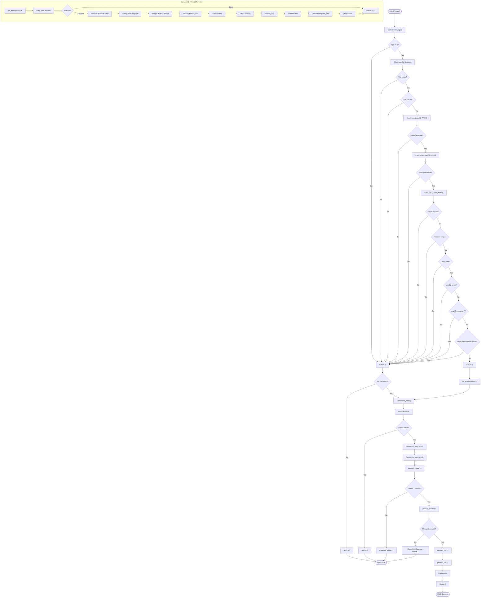

# args
runner "path to data file" "path to producer" "path to consumer" "cpu cores(3) sep with ','" "shm name"

## prod/cons args
producer/consumer "shm name" "path to data file"

## flowchart:

```mermaid
flowchart TD
    A(["START: main()"]) --> B["Call validate_args()"]
    B --> C{" argc == 6?"}
    C -->|No| D["Return 1"]
    C -->|Yes| E["Check argv[1] file exists"]
    E --> F{" File exists?"}
    F -->|No| D
    F -->|Yes| G{" File size > 0?"}
    G -->|No| D
    G -->|Yes| H["check_exec(argv[2], PROD)"]
    H --> I{" Valid executable?"}
    I -->|No| D
    I -->|Yes| J["check_exec(argv[3], CONS)"]
    J --> K{" Valid executable?"}
    K -->|No| D
    K -->|Yes| L["check_cpu_cores(argv[4])"]
    L --> M{" Parse 3 cores?"}
    M -->|No| D
    M -->|Yes| N{" All cores unique?"}
    N -->|No| D
    N -->|Yes| O{" Cores valid?"}
    O -->|No| D
    O -->|Yes| P{" argv[5] empty?"}
    P -->|Yes| D
    P -->|No| Q{" argv[5] contains '/'?"}
    Q -->|Yes| D
    Q -->|No| R{" shm_name already exists?"}
    R -->|Yes| D
    R -->|No| S["Return 0"]
    S --> T["pin_thread(cores[0])"]
    D --> U{" Pin successful?"}
    U -->|No| V["Return 1"]
    U -->|Yes| W["Call spanw_procs()"]
    T --> W
    W --> X["Initialize barrier"]
    X --> Y{" Barrier init ok?"}
    Y -->|No| Z["Return 1"]
    Y -->|Yes| AA["Create pthr_argv args1"]
    AA --> AB["Create pthr_argv args2"]
    AB --> AC["pthread_create t1"]
    AC --> AD{" Thread 1 created?"}
    AD -->|No| AE["Clean up, Return 1"]
    AD -->|Yes| AF["pthread_create t2"]
    AF --> AG{" Thread 2 created?"}
    AG -->|No| AH["Cancel t1, Clean up, Return 1"]
    AG -->|Yes| AI["pthread_join t1"]
    AI --> AJ["pthread_join t2"]
    AJ --> AK["Print results"]
    AK --> AL["Return 0"]
    
    subgraph "run_proc() - Thread Function"
        AM["pin_thread(core_id)"]
        AN["fork() child process"]
        AO{" Fork ok?"}
        AP["Send SIGSTOP to child"]
        AQ["execl() child program"]
        AR["waitpid WUNTRACED"]
        AS["pthread_barrier_wait"]
        AT["Get start time"]
        AU["kill(SIGCONT)"]
        AV["waitpid() exit"]
        AW["Get end time"]
        AX["Calculate elapsed_time"]
        AY["Print results"]
        AZ["Return NULL"]
    end
    
    AM --> AN
    AN --> AO
    AO -->|Error| AZ
    AO -->|Success| AP
    AP --> AQ
    AQ --> AR
    AR --> AS
    AS --> AT
    AT --> AU
    AU --> AV
    AV --> AW
    AW --> AX
    AX --> AY
    AY --> AZ
    
    AL --> BA(["END: Success"])
    V --> BB(["END: Error"])
    Z --> BB
    AE --> BB
    AH --> BB
```
